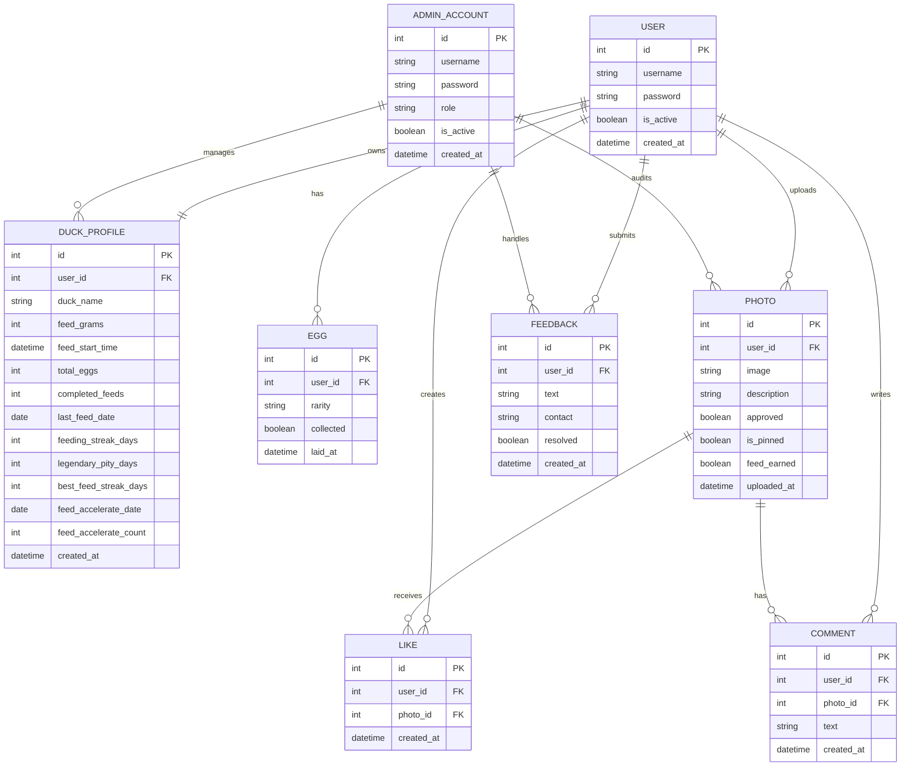

# 明湖鸭鸭系统 ER 图

## 关系说明

- `ADMIN_ACCOUNT` 与 `USER`：两套不同账号体系。管理员账号只用于后台管理，前台用户账号只用于鸭舍、社区、投喂、收集等用户功能，二者不同步。
- `USER` 与 `DUCK_PROFILE`：一对一。每个前台用户对应一个鸭鸭档案。
- `USER` 与 `EGG`：一对多。一个用户可以拥有多个鸭蛋。
- `USER` 与 `PHOTO`：一对多。一个用户可以上传多张社区照片。
- `USER` 与 `LIKE`：一对多。一个用户可以产生多个点赞记录。
- `PHOTO` 与 `LIKE`：一对多。一张照片可以收到多个点赞。
- `USER` 与 `COMMENT`：一对多。一个用户可以发表多条评论。
- `PHOTO` 与 `COMMENT`：一对多。一张照片可以有多条评论。
- `USER` 与 `FEEDBACK`：一对多。一个用户可以提交多条反馈。
- `LIKE` 对 `(user_id, photo_id)` 有唯一约束，表示同一用户对同一张照片只能点赞一次。
- `ADMIN_ACCOUNT` 与 `DUCK_PROFILE`：一对多管理关系。管理员可以修改用户鸭鸭档案，例如调整 `feed_grams` 饲料数、喂养次数、连续天数等。
- `ADMIN_ACCOUNT` 与 `PHOTO`：一对多审核关系。管理员可以审核、置顶、删除社区照片。
- `ADMIN_ACCOUNT` 与 `FEEDBACK`：一对多处理关系。管理员可以查看并标记用户反馈的处理状态。
